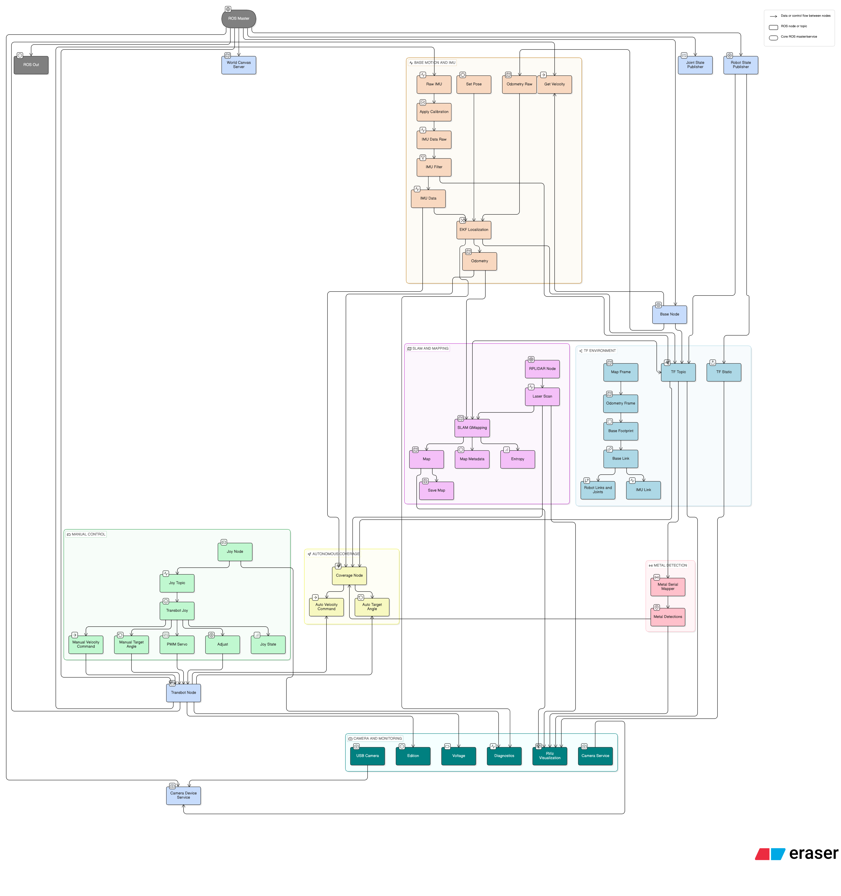
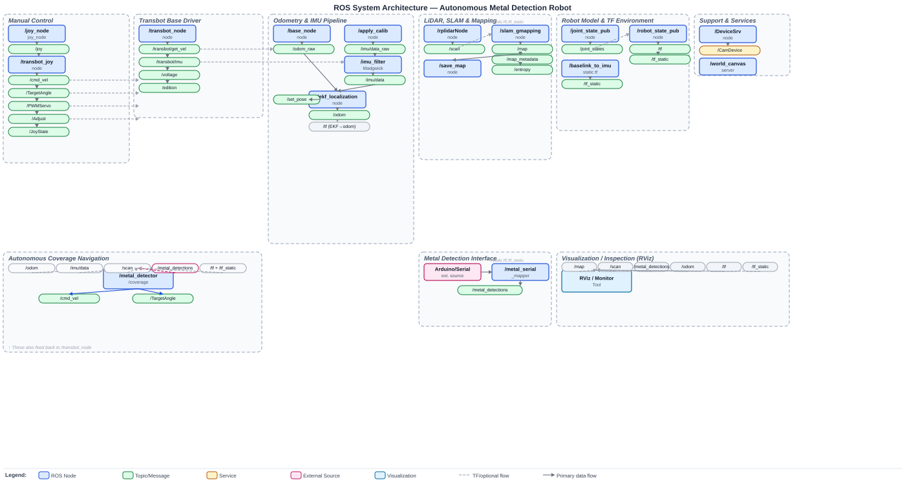

# Autonomous Mine Detection and Mapping Robot

## Team Leader

Farid Ibadov

## Student Name(s)

Farid Ibadov
Nizami Guliyev
Ali Ganizade
Murad Ramazanov

## Student ID(s)

Farid - 17954
Nizami - 15981
Ali - 17477
Murad - 18054

## Programme

Farid - BSCE26
Nizami - BSCE26
Ali - BSEEE26
Murad - BSEEE26

## Supervisor

Dr. Alexz Farrall

## Submission Date

28 April, 2026

---

# Table of Contents

1. [Introduction](#1-introduction)  
   1.1 [Project Background](#11-project-background)  
   1.2 [Problem Statement](#12-problem-statement-summary-only)  
   1.3 [Project Objectives and Success Criteria](#13-project-objectives-and-success-criteria)  
   1.4 [Scope of the Final Report](#14-scope-of-the-final-report)  
   1.5 [Relationship to Previous Research and Design Report](#15-relationship-to-previous-research-and-design-report)

2. [Final System Overview](#2-final-system-overview)  
   2.1 [Overview of Final Design / System](#21-overview-of-final-design--system)  
   2.2 [Overall Architecture or Configuration](#22-overall-architecture-or-configuration)  
   2.3 [Description of Major Components or Subsystems](#23-description-of-major-components-or-subsystems)  
   2.4 [Final Design Specifications](#24-final-design-specifications)  
   2.5 [Differences from Original Proposed Design](#25-differences-from-original-proposed-design)  
   2.6 [Materials, Components, Tools, or Resources Used](#26-materials-components-tools-or-resources-used)

3. [Implementation](#3-implementation)  
   3.1 [Development or Realisation Approach](#31-development-or-realisation-approach)  
   3.2 [Fabrication, Construction, or Development Process](#32-fabrication-construction-or-development-process)  
   3.3 [Methods, Techniques, or Procedures Used](#33-methods-techniques-or-procedures-used)  
   3.4 [Integration of Components or Subsystems](#34-integration-of-components-or-subsystems)  
   3.5 [Challenges Encountered and Solutions](#35-challenges-encountered-and-solutions)  
   3.6 [Design Iterations and Improvements](#36-design-iterations-and-improvements)

4. [Testing and Validation](#4-testing-and-validation)  
   4.1 [Testing or Evaluation Strategy](#41-testing-or-evaluation-strategy)  
   4.2 [Verification of Requirements](#42-verification-of-requirements)  
   4.3 [Experimental Setup or Evaluation Environment](#43-experimental-setup-or-evaluation-environment)  
   4.4 [Test Procedures](#44-test-procedures)  
   4.5 [Results](#45-results)  
   4.6 [Analysis of Results](#46-analysis-of-results)  
   4.7 [Validation Against Success Criteria](#47-validation-against-success-criteria)  
   4.8 [Limitations of Testing](#48-limitations-of-testing)

5. [Project Outcomes](#5-project-outcomes)  
   5.1 [Summary of Deliverables](#51-summary-of-deliverables)  
   5.2 [Achieved Functionality or Performance](#52-achieved-functionality-or-performance)  
   5.3 [Achievement of Project Objectives](#53-achievement-of-project-objectives)  
   5.4 [Comparison with Expected Outcomes](#54-comparison-with-expected-outcomes)  
   5.5 [Key Technical Contributions](#55-key-technical-contributions)  
   5.6 [Limitations of the Final Design](#56-limitations-of-the-final-design)

6. [Project Management Reflection](#6-project-management-reflection)  
   6.1 [Planned vs Actual Progress](#61-planned-vs-actual-progress)  
   6.2 [Resource Utilisation](#62-resource-utilisation)  
   6.3 [Risk Management Outcomes](#63-risk-management-outcomes)  
   6.4 [Team Roles and Contributions](#64-team-roles-and-contributions)  
   6.5 [Lessons Learned from Project Execution](#65-lessons-learned-from-project-execution)

7. [Future Work](#7-future-work)  
   7.1 [Recommended Improvements](#71-recommended-improvements)  
   7.2 [Opportunities for Further Development](#72-opportunities-for-further-development)  
   7.3 [Opportunities for Further Investigation](#73-opportunities-for-further-investigation)

8. [Conclusion](#8-conclusion)  
   8.1 [Summary of Achievements](#81-summary-of-achievements)  
   8.2 [Overall Contribution of the Project](#82-overall-contribution-of-the-project)

9. [References](#references)


---

# 1. Introduction

## 1.1 Project Background

The system itself is a mobile robotic platform, supporting localization, and navigation with coverage of an autonomous robot for mapping and mine detection. The project was based on the Yahboom Transbot robotic platform, which was available in the lab, and previously had a Raspberry Pi 4 as an onboard computer. However, the final version of the project uses an NVIDIA Jetson Nano B01 Developer Kit. The reason for this change was the increased system requirements for the project, which demand continuous and simultaneous execution of ROS nodes for LiDAR scanning, localization, camera monitoring, autonomous navigation, and mapping of detected metal objects.

The Transbot is a robotic platform that specializes in functions such as motion control, remote communication, mapping, navigation, obstacle avoidance, autonomous operation, and manipulation using a robotic arm `[1]`. Its tracked platform provides a very robust and reliable method of locomotion. However, this also creates additional challenges, such as the possibility of drifting while moving, imprecise turns, and track slippage on certain surfaces. The final deployed system uses Ubuntu 18.04.6 LTS, ROS Melodic, Python 2.7.17, JetPack 4.5.1, and an NVIDIA Jetson Nano Developer Kit `[2]` `[3]`.

```txt
Platform audit confirmation:
Device tree model: NVIDIA Jetson Nano Developer Kit
Description: Ubuntu 18.04.6 LTS
ROS_DISTRO=melodic
Python 2.7.17
JetPack 4.5.1 / L4T 32.5.1
```

The mobile robot platform is used not only as a robot controlled manually by remote control. It has been upgraded into an autonomous system that completely and independently scans a rectangular area, the width and length of which are entered before movement. It scans according to lawnmower logic, covering the entire area, mapping the terrain, marking detected metal locations, and avoiding obstacles without collision.

Transbot "out of box":


Our Final System:


Autonomous landmine detection robot needs sensing system which will be able to detect metal objects, so metal detector was developed by using LC oscillator circuit for landmine detection. Detector is based on a search coil and capacitor network where coil has inductance of 400 µH and forms resonant tank circuit with capacitors C2 and C3. Theoretical frequency relation for circuit was used as background support for oscillator design `[4]`.

For the oscillator-based detector to operate properly, it requires a stable voltage supply. The detector was first tested using a 12 V DC power supply in a laboratory. However, further implementation of a portable source on Transbot was needed. It was achieved by using three 18650 lithium-ion batteries, where 18650 means diameter is 18 mm, length is 65 mm, and 0 means cylindrical shape, connected in series to power the detector circuit `[5]`.

## 1.2 Problem Statement

The main problem and difficulty was to ensure correct and reliable movement and localization of the robot in a clearly defined scanning area, in which it had to move along a specific trajectory, similar to the trajectory of a lawnmower, scan the area using a search coil mounted to the front while keeping it close enough to the ground, avoid obstacles, and not go off the path or get lost in the space. So, several platform-level challenges were observed and mitigated to meet the project's requirements and goals.

The first challenge was that the platform is a tracked base that turns using a tank-like turn system, where the tracks move in the opposite direction when the robot turns in place, and a specific track lock when the robot turns while moving. Although this type of platform is mechanically very stable and robust, precision is significantly compromised due to differences in friction under the tracks. The robot can drift left or right, and both occur quite unpredictably. Also, during straight-line movement, slight differences in friction under the tracks can result in deviation from the trajectory. In the project itself, before the control methods were added, observations revealed that the robot most often drifted to the right due to physical imperfections and a shifted center of mass.

The next challenge was that the robot's original morphology did not meet our project criteria. Therefore, some modifications were made, such as a custom 3D-printed case for the search coil. This was added to the last segment of the robotic arm, in place of the grippers, which were removed. The LiDAR itself was also raised 2 centimeters from its original position to prevent the search coil and HD camera, which was also introduced for manual FPV control from a distance, from obstructing the LiDAR's field of view. These modifications significantly increased the robot's final dimensions. This, in turn, also created a problem: now we had to account for the changed dimensions in the movement code and set appropriate thresholds to prevent collisions.


The final challenge was that autonomous mine detection required complete zone coverage, not just simple movement from point A to point B. The robot had to explore the entire designated area before completing its mission, avoiding all obstacles and identifying all high-threat locations. Thus, in summary, the system had to combine zone coverage, obstacle avoidance, and accurate detection and localization.

In order for the robot to detect land mines on its own, reliable metal detection was required, and even small changes of inductance of coil had to be converted into stable electrical signal. As raw oscillator signal was analog and high frequency, it was not safe and reliable to connect it directly to Arduino digital input, therefore, before microcontroller processing, signal conditioning and voltage limitation were required.

The search coil's parameters and design were selected carefully because the coil should provide sufficient inductance for the oscillator and also be suitable for mounting on the Transbot. The portable power supply was required to provide the detector circuit with the required voltage. Moreover, the size and weight of the power supply should be selected in a way that does not overload the Transbot.

## 1.3 Project Objectives and Success Criteria

The goals of the mobile robotic platform were the adaptation of the transport platform for mine detection operations; migration from Raspberry Pi 4 to NVIDIA Jetson Nano; localization and navigation with full coverage; LiDAR integration; odometry; IMU; camera support; manufacturing and installation of a 3D-printed casing; implementation of autonomous rectangular coverage with corresponding obstacle avoidance.

Thus, this subsystem is considered successful if the robot is able to completely scan and cover a rectangular scanning area, avoid all obstacles without collision, and maintain a fixed detector base position while scanning. In the final test of this configuration, the robot scanned a 2 × 2 m area with a 0.22 m spacing between stripes, successfully avoided all obstacles, and performed properly in both laboratory and outdoor field conditions.

Implementation of stable LC oscillator based metal detector was the main objective of this project, also circuit had to still sensitive to small changes of inductance which are caused by metal objects. Stable oscillation, predictable signal changes near metal objects, safe Arduino input voltage, and reliable digital monitoring of frequency defined success of the project.

The main objective for the search coil design was to match the oscillator circuit requirements and to physically operate on the Transbot. The power supply was analyzed based on how closely it could match the laboratory 12 V supply without adding extra weight to the Transbot, and its integration with a BMS (battery management system) for protection.

Subsurface Detection: Use an analog metal detection subsystem. Success metric: reliable detection of metallic objects buried up to 10 cm deep with a low false negative rate (high Recall), as demonstrated in the recorded test video submitted to the supervisor.

Mapping and Logging in Space: Use 2D LiDAR and ROS to map the space. Success criterion: correct coordinate logging of detected metallic anomalies and 2D grid map generation in RViz.

System Integration and Control: Design a central control interface. Success criterion: create a low-latency web dashboard featuring real-time video streaming, sensor telemetry, and robust teleoperation over a tethered or local network.

Hardware-Software Bridge: Build solid communication between subsystems. Success criterion: reliable serial data transmission and synchronization between the main processor Jetson Nano and the Arduino microcontroller.

## 1.4 Scope of the Final Report

The section on the mobile robotic platform, localization, and spatial navigation covers the implementation of the robot configuration itself, the transition from one computer system to another, physical morphological changes, the architecture of LiDAR and camera integration, localization, as well as autonomous movement with spatial coverage, obstacle avoidance, and testing the functionality of all systems.

This report also covers the detector oscillator subsystem, search coil design, portable power supply, Arduino-Jetson integration, dashboard, sensor filtering, testing, and system integration. The detailed design is organized according to the final report template so that each subsystem is presented under the same main headings.

## 1.5 Relationship to Previous Research and Design Report

Overall, the final design is consistent with the previously developed one, with minor modifications such as slightly altered robot morphology, peripheral placement, movement method using the so-called lawnmower method, as well as various control methods and those that assist in cases of track slippage, trajectory deviation, obstacle avoidance, and returning to the lane of trajectory.

Final design was developed from earlier research and design, but the original plan was to use Arduino Uno; however, Arduino Nano was used instead for compactness and easier integration into the limited space available on the Transbot platform. As it was originally planned, base sensing principle works in a way that metal presence was detected through the changes of LC oscillator signal which were caused by changes of inductance of search coil.

The coil design was based on the design of the reference detector, which recommended an inductance of about 200–400 µH so that the oscillator frequency remained suitable for Arduino measurements. A round coil with a diameter of 200 mm with 26 turns and an insulated copper wire with a thickness of 0.40 mm was chosen because it provided a calculated inductance close to this range, about 406 µH, with a resistance of 2.2 Ω. The final battery design was developed during the laboratory testing, when the detector circuit was powered from a 12 V DC supply. To transfer the detector from laboratory testing to operation on Transbot, three 18650 lithium-ion cells were connected in series to provide a voltage of approximately 11.1 V nominal and a full charge of up to 12.6 V.

---

# 2. Final System Overview

## 2.1 Overview of Final Design / System

The final mobile robot platform is a Yahboom Transbot configured for manual/autonomous navigation and mine mapping. The robot uses tracks for locomotion, an NVIDIA Jetson Nano as an onboard computer, a 2D RPLIDAR A1 LiDAR for scanning, an IMU and wheel odometry for localization, an HD USB camera for monitoring, and a fixed 2-joint robotic arm to support the search coil with its casing, printed using a 3D printer. The final robot weight is approximately 5 kg.

The final autonomous navigation logic was developed in ROS Melodic using a custom controller written in Python. The controller takes a rectangular area the user wants to scan and divides it into parallel lines along which the robot then moves like a lawnmower, avoiding all obstacles and returning to the original line after completing the scan, pausing for a while when metal is detected.

The final navigation script emphasizes that the system is controlled like a tracked tank, with the controller designed to verify the heading, correct motion based on the PID, perform recovery from stalling, calibrate odometry and distance, and avoid obstacles. It also specifies the robotic arm joints, with the intended fixed posture defined around J7 = 90° and J8 = 105°. During the recorded autonomous run shown in the terminal output, a slightly adjusted practical posture of J7 = 82° and J8 = 105° was used, which was acceptable for keeping the coil at the required scanning position. The robot, which is 0.7 m long and 0.26 m wide, has a LiDAR mounted so that it faces backward, but is adjusted in software by a 180° offset.

```python
# Constants from the final autonomous navigation script
DIST_SCALE = 1.0433 # real/odom ratio from calibration
LIDAR_ANGLE_OFFSET = 180.0 # LiDAR faces rear
FOV_HALF_DEG = 10.0 # front sector for obstacle detection

ARM_J7 = 90.0
ARM_J8 = 105.0
ARM_TIME_MS = 600

ROBOT_W = 0.26
ROBOT_L = 0.70 # with arm
LIDAR_TO_FRONT = 0.60
LIDAR_TO_REAR = 0.10
```

During the recorded autonomous run, the arm posture was practically adjusted to J7 = 82° and J8 = 105°, while the intended fixed posture in the final script remained around J7 = 90° and J8 = 105°.

Designed system consists of search coil, LC resonant circuit with transistor BC337, signal conditioning stage, and Arduino Nano digital input, where oscillation is generated by transistor circuit, and coil inductance is changed by induced eddy currents near metal, resulting in changes in oscillation frequency. Also, eddy current theory supports the use of coil response changes for conductive object detection `[6]`.

The detector system consisted of the search coil and portable power supply. The search coil had two roles: a sensing role and electrical role. In a sensing role, it creates a magnetic field to interact with metal objects, and in electrical role, the search coil behaves as an inductor in the oscillator circuit.

The portable power supply was used to power the detector circuit. Three 18650 lithium-ion batteries were used in a series connection to form a 3S pack, where 3S means three batteries connected in series. The pack provided a voltage level close to laboratory testing, which was 12 V. This specific voltage level was used because of Arduino Nano, as it operates at 5 V. By supplying it with 12 V, the remaining voltage is converted to heat, because built-in voltage regulator reduces it to 5 V. During the 12 V DC power supply testing in the laboratory, the measured current was 20 mA. Power dissipated as heat is 0.14 W, which is relatively small, meaning regulator should not overheat.


18650 lithium-ion cell:


## 2.2 Overall Architecture or Configuration

The architecture of the final system can be explained in four layers.

1. The first layer is the **mechanical platform**, which consists of a chassis, tracks, motor mounts for the camera and LiDAR, supports for the servo motors, and a coil casing.

2. The second layer was the **onboard computing layer** where the Raspberry Pi 4 was replaced with the Jetson Nano B01 Developer Kit. The main system characteristics of both computing platforms are summarized in the following table:

| **Characteristic** | **Original Configuration: Raspberry Pi 4** | **Final Configuration: Jetson Nano B01 Developer Kit** |
| ----------------------------------- | ----------------------------------------------------------------- | ----------------------------------------------------------------------------------------------------- |
| **Role** in the system | Initial onboard computer used on the laboratory Transbot platform | Final onboard computer used for the integrated autonomous robot |
| **Processor** | Quad-core ARM Cortex-A72 | Quad-core ARM Cortex-A57 |
| **GPU** | Broadcom VideoCore VI | 128-core NVIDIA Maxwell GPU |
| **Memory** | 2 GB LPDDR4 memory | 4 GB LPDDR4 |
| **OS** used in final robot | Not used in final implementation | Ubuntu 18.04.6 LTS |
| **ROS** version used in final robot | Not used in final implementation | ROS Melodic |
| Main **programming environment** | Suitable for basic robot control and lightweight ROS tasks | Suitable for running several ROS nodes simultaneously |
| Main **purpose** in the project | Previous/initial platform computer | Final computer for LiDAR processing, SLAM, localization, camera monitoring, and autonomous navigation |
| **Reason** for replacement | Limited suitability for the final integrated workload | Higher computational capability and better suitability for robotics/perception tasks |
| Final project status | Replaced | Used in final prototype |

3. The third layer is responsible for **localization**; it includes RPLIDAR A1, odometry, filtering based on IMU, EKF localization, and SLAM. The final version of the robot runs on ROS Melodic on Ubuntu 18.04.6 LTS.

4. The fourth layer is a custom **navigation layer**, implemented in the `sdp_nfam` folder. This layer performs navigation along a specified rectangular area with maximum coverage, heading correction, collision and obstacle avoidance, returning to the driving lane in the event of drifting away, and responding to metal object detection.

```txt
ROS environment from the system audit:
ROS_DISTRO=melodic
ROS_MASTER_URI=http://localhost:11311
ROS_PACKAGE_PATH=/home/jetson/software/laser_app/src:/home/jetson/transbot_ws/src:/home/jetson/software/transbot_library/src:/home/jetson/software/world_canvas/src:/opt/ros/melodic/share
```

- ROS Runtime Architecture:


- ROS System Architecture


Basically, signal processing circuit works like this: signal passes through the coil and capacitors C2 and C3, then through BC337 oscillator, then through C5 for AC coupling, then through R4 for current and load limiting, then through Zener diode D1 for voltage limiting, and finally to Arduino Nano digital input. LC circuit generates sensor signal, transistor stage maintains oscillations through feedback, and output signal processing stage adapts signal for safe input to microcontroller.

Circuit schematic:


The search coil is positioned in front of the Transbot and connected with the detector circuit, which is placed on the Transbot itself. The battery pack, consisting of three 18650 lithium-ion cells connected in series, is placed near the detector circuit and supplies it with power. The BMS (battery management system) is located on the back of the battery pack, making the system compact.

3S battery and BMS diagram:


## 2.3 Description of Major Components or Subsystems

The **mobile base** subsystem consists of a tracked chassis, DC motors, a motor controller, a battery, and an interface for base control. Although the tank track mechanism provides greater stability on the ground due to its large contact area and reduced ground pressure, it also introduces drifting and imprecise turns, which require additional software settings.

The **onboard computer** subsystem is an NVIDIA Jetson Nano development kit with four Cortex-A57 CPU cores and approximately 3.9 GB of memory.

```txt
CPU info from the platform audit:
Device tree model: NVIDIA Jetson Nano Developer Kit
Architecture: aarch64
CPU(s): 4
Model name: Cortex-A57
CPU max MHz: 1479.0000
Memory: 3.9G total
```

The **LiDAR** subsystem uses the RPLIDAR A1, a 360-degree 2D laser scanner that utilizes laser triangulation and high-speed sampling for real-time mapping and robot navigation `[7]`. It was additionally elevated approximately 2 cm from its factory mounting position to reduce self-shadowing by the robot body and coil housing. The navigation code also uses a 180° angle offset due to the LiDAR's rear-facing physical orientation.


The **camera** subsystem utilized an HD USB camera. This USB 2.0 camera, connected via `/dev/video0`, supports MJPEG formats, including 1280 × 720 at 60 fps and 1920 × 1080 at 30 fps. It is not a sensor for autonomous navigation, but is used only during manual control and monitoring.


```txt
Camera information from the platform audit:
USB 2.0 Camera
Device: /dev/video0
Format: MJPG
1280x720 at 60 fps
1920x1080 at 30 fps
```

The **detector's support** subsystem consists of fixed-position robotic arm servos and a 3D-printed coil housing. The housing was designed in Autodesk Fusion, printed from ABS plastic, and attached with screws. It is ring-shaped, approximately 222 mm in diameter and approximately 250 mm long. The coil is positioned approximately 2–3 cm above the ground, sufficient for accurate scanning while minimizing the risk of damage from impacts on uneven ground.

The main sensing element is search coil, which operates in such a way that when metal object approaches the coil, magnetic field and effective inductance of the coil change. Capacitors C2 and C3 form resonant circuit with search coil, where oscillation frequency is determined by values of inductance and capacitance. BC337 transistor is used as amplifier in feedback configuration, where part of oscillatory signal is fed back to the base of the transistor through capacitor network, which ensures stable oscillations. In addition, according to technical documentation, BC337 is suitable for use in pulse amplifiers `[8]`. Resistors R2 and R3 form voltage divider to offset the base of the transistor, which allows transistor to operate in correct mode, and resistor R1, connected to the emitter, stabilizes the current. Capacitor C1 helps filter and stabilize emitter signal, while capacitor C4 provides additional base filtering and reduces noise in bias voltage. Capacitor C5 is used to connect alternating current from collector of the transistor to the output stage, so DC component is removed and only oscillatory signal passes through. For stable load, R4 resistor is used, and D1 Zener diode reduces voltage to about 4.3 V, thereby protecting Arduino Nano input, since voltage fixation using Zener diode is standard way to limit voltage at a set level `[9]`. Arduino Nano is used to monitor the signal, as it is necessary to observe the frequency change over time in order to detect presence of metal. Also, to ensure compatibility at the board level and measurements based on the pulse input signal, Arduino Nano documentation and reference materials on Arduino synchronization were consistently used `[10]` `[11]`.

Oscillator operates by continuously exchanging energy between magnetic field of the coil and electric field of the capacitors in LC circuit, while BC337 transistor compensates losses by amplifying and returning part of the signal back to resonant circuit, which allows for stable oscillations to be maintained. For AC analysis, power supply rail can be considered as AC ground, so C2 and C3 act as part of the oscillatory and feedback circuit, with 400 µH search coil and effective capacitance determining fundamental oscillation frequency, since C2 and C3 form capacitive divider, effective capacitance can be estimated as:

$$
C_{eq}=\frac{C_2 \times C_3}{C_2+C_3}
$$

which gives approximately 0.91 nF for $C_2 = 1\text{ nF}$ and $C_3 = 10\text{ nF}$. Ideal resonant frequency can be estimated by the formula:

$$
f_0=\frac{1}{2\pi\sqrt{L C_{eq}}}
$$

and with $L = 400\ \mu\text{H}$ and $C_{eq} = 0.91\text{ nF}$, ideal frequency is about 264 kHz, although actual frequency may vary because coil resistance, transistor capacitance, PCB capacitance, wiring, and nearby metal objects also affect circuit's performance.

Resistors R2 and R3 form voltage divider as they are connected in series between 12 V supply and ground, with base of the transistor connected to their midpoint, so voltage at the base is given by resistor ratio as:

$$
V_B=V_{CC}\frac{R_3}{R_2+R_3}
$$

which gives approximately 3.84 V at $V_{CC}=12\text{ V}$, $R_2=10\text{ k}\Omega$ and $R_3=4.7\text{ k}\Omega$. This voltage at the base biases transistor above the emitter, allowing it to operate in active mode, with emitter voltage being about 0.7 V lower than base voltage due to the base-emitter junction, giving about 3.1 V at the emitter and calculated emitter current of:

$$
I_E=\frac{V_B-0.7}{R_1}\approx 14\text{ mA}
$$

with $R_1=220\Omega$. This bias current is sufficient to maintain stable oscillations, and resistor R1 also provides negative feedback, since any increase in emitter current raises voltage across R1, reduces base-emitter voltage, and prevents transistor current from increasing excessively.

The search coil is a major component of the project, as its role as a sensing element is to interact with and identify metal objects by creating a magnetic field. For the search coil implementation, the reference design was used to select the right diameter, number of turns and copper wire thickness in order to achieve the required inductance for the oscillator circuit. The portable power source is another vital element in the project, as it should provide a stable voltage to the detector circuit, because the detector circuit is analog, which generates a continuous electrical signal. As a result, any fluctuations in supply voltage can result in oscillation frequency and amplitude change, reducing sensitivity and detection stability.

**Cartography**

Since the subject of the project revolves around mine detection, all this will not work without mapping. The robot's system itself has LiDAR and a specific RViz application that is responsible for visualizing what the LiDAR sees. Based on this database, it was decided to build a map and mark its location where the metal is located on the map and on the basis of all this, along with objects around it, a map with all important data is built.

**System Integrations**

To implement communication between the metal detector sensor and the robot, an Arduino Nano microcontroller and the Jetson Nano onboard computer were used for communication between the detector subsystem and the robot system. The Arduino Nano provides sensor data, and the Jetson Nano takes it all in. Communication takes place through the internal Jetson Nano OS, which is based on Ubuntu. Ubuntu, since it is a large independent operating system, supports most applications and also Arduino applications. Because of this, the Arduino CLI was installed in the Jetson Nano Ubuntu environment to compile, upload, and manage Arduino code from the terminal, and the sensor works after the code is uploaded to the Arduino Nano. The second and final interaction takes place through Arduino Nano and in its program code based on metal detection through the `Serial.print` function, Jetson Nano receives data itself and in order for the system to clearly interact with this data, a Python script was written that read data through the PySerial library and through the main codes for manual and autonomous movement.

Arduino/terminal integration:


**Dashboard**

The specifics of our task so that the robot finds mines and the area where the mines are located can be time-consuming and the classic automatic method of robot interaction would not be effective. For this purpose, it was decided to use manual control via the controller as well. Since the ROS system of this robot supported controlling the robot via a controller, this greatly simplified the development of an application to control the robot. The robot had everything necessary to implement manual control, and in particular a camera through which it could be controlled through the controller on different sides to the left, right, or up and down. Also moving to the side of the controller includes its movement on the linear and angular side which is very convenient and it also included the movement of the robot arm which makes it very easy to work in very time consuming places where the movement of the robot arm on which the metal detector is attached plays a very important role in such places. The second is the implementation of the dashboard itself, for this purpose a classic website was developed that is responsible for displaying images from cameras, data that it receives from the sensor, and also for the movement of speed and this is all displayed on the platform. The implementation of all this happens through a hotspot that distributes the phone itself and based on the IP address that we get through the same phone, we go to the Dashboard for management.

Dashboard interface:


**User Experience**

As shown in the photo above, this is a UI representation of the dashboard, how it works.

1. The principle of connection: it works based on a local connection via an IP address, through which we get full access to the robot itself, the metal detector and the camera, through which it is possible to see and control the robot's environment.
2. System: after connection, the user can control the robot, the movement of the robot itself, the hand and the camera through the controller.
3. Data: while the robots are working, the user sees all the important data they receive. Linear velocity, angular velocity, data from the metal detector and logs, which are very important in case of a lost connection and to understand that the error has occurred.

System workflow / overflow:


## 2.4 Final Design Specifications

In the following table the major components of the navigation/localization subsystem are listed.

| **Parameter** | **Final value** |
| --------------------------- | ------------------------------------------- |
| Project title | Autonomous Mine Detection and Mapping Robot |
| Platform | Yahboom Transbot |
| Drive system | Tank-track / skid-steer |
| Original computer | Raspberry Pi 4 |
| Final computer | NVIDIA Jetson Nano B01 Developer Kit |
| Operating system | Ubuntu 18.04.6 LTS |
| ROS version | ROS Melodic |
| Main navigation language | Python 2.7 |
| LiDAR | RPLIDAR A1 |
| Camera | HD USB camera |
| Approximate robot mass | 5 kg |
| Software robot length model | 0.70 m |
| Software robot width model | 0.26 m |
| LiDAR-to-front distance | 0.60 m |
| Coil casing material | ABS |
| Coil casing design software | Autodesk Fusion |
| Coil casing diameter | 222 mm |
| Coil casing length | Around 250 mm |
| Coil height above ground | 2–3 cm |
| Final test area | 2 m × 2 m |
| Final lane spacing | Approximately 0.22 m |

The robot dimensions and LiDAR offset are directly inherited in the navigation code. Those were manually measured beforehand, to ensure that the dimensions of the robot are compatible with the environment it perceives. It included `ROBOT_L = 0.70`, `ROBOT_W = 0.26`, `LIDAR_TO_FRONT = 0.60`, and obstacle-distance parameters such as `BUMPER_DANGER = 0.18` and `BUMPER_SLOW = 0.50`. These values produced a hard stop distance of approximately 0.78 m and a slow zone of approximately 1.10 m.

```python
# Obstacle-distance model from the final navigation code
LIDAR_TO_FRONT = 0.60

BUMPER_DANGER = 0.18 # hard stop: 0.60 + 0.18 = 0.78 m
BUMPER_SLOW = 0.50 # slow zone: 0.60 + 0.50 = 1.10 m

zone_danger = LIDAR_TO_FRONT + BUMPER_DANGER
zone_slow = LIDAR_TO_FRONT + BUMPER_SLOW
```

Dimensions of Robot measured manually:


The final design uses LC oscillator detector with a search coil of approximately 400 µH forming a resonant tank circuit with capacitors C2 and C3, BC337 transistor as feedback amplifier, resistors R2 and R3 as bias voltage divider, resistor R1 with capacitor C1 for emitter stabilization and filtering, capacitor C4 for base noise suppression, capacitor C5 for AC coupling at the output, resistor R4 with 4.3 V Zener diode D1 for current limiting and signal clamping, and Arduino Nano digital input for monitoring signal behavior. Chosen values were selected to keep oscillator in a useful frequency range while providing balance between sensitivity and stability, as 400 µH coil provides enough inductance to detect metal while still maintaining high frequency operation, and C2 = 1 nF with C3 = 10 nF gives effective capacitance of around 0.91 nF, allowing ideal oscillation frequency to be set in hundreds of kilohertz range. This range is suitable because small changes in inductance can cause measurable changes in frequency. Resistors R2 = 10 kΩ and R3 = 4.7 kΩ provided stable base bias for BC337 transistor, resistor R1 = 220 Ω limited and stabilized the emitter current, capacitor C1 = 3.3 nF stabilized high-frequency emitter signal, and capacitor C4 = 100 nF reduced noise in bias and feedback regions. These values were adjusted during testing, as the first version of oscillator was sensitive but unstable.

For the final search coil design, these parameters were selected:

| Parameter | Value |
|---|---|
| Diameter of the coil | 200 mm |
| Copper wire thickness | 0.40 mm |
| Number of turns | 26 |
| Resistance value | 2.2 Ω |
| Estimated inductance | 406 µH |

To calculate the inductance, formula by James Maxwell was used:

$$
L \approx \mu_0 N^2 R\left[\ln\left(\frac{8R}{a}\right)-2\right]
$$

where $N$ is number of turns, $\mu_0$ is magnetic constant $(4\pi \times 10^{-7})$, $R$ is radius of the coil in meters, and $a$ is radius of the cross-section of the wire.

After the calculations, and based on the reference table, inductance equals to 406 µH with the selected number of turns (26). If number of turns would be smaller, the inductance could drop, resulting in higher oscillator frequency, which causes difficulties for Arduino to read the signal correctly. On the other hand, by increasing number of turns, the inductance would increase, resulting in lower oscillator frequency following the formula:

$$
f=\frac{1}{2\pi\sqrt{LC}}
$$

As a result, the 26 turns is the balanced number of turns for achieving approximately 400 µH.

The reference design required inductance in a range of 200–400 µH, and 406 µH is close to the recommended range. The large number of turns would result in a higher inductance value, however, it would lead to higher resistance value, resulting in heating and power losses. For this reason, 26 turns satisfy both the required inductance and practical resistance. The 200 mm diameter for the search coil was suitable for mounting on the Transbot and ground scanning, because it provided a balance between smaller coils, which are used for detecting small items, and larger coils, which are better for large object detection.

The 2.2 Ω was calculated by following steps:

1. First we calculate the length of one turn:

$$
l=\pi D
$$

where $D=200\text{ mm}=0.2\text{ m}$, therefore:

$$
l=\pi \times 0.2 \approx 0.628\text{ m}
$$

2. Calculating the total length of the wire by multiplying to the number of turns:

$$
l_{total}=0.628\times 26\approx 16.33\text{ m}
$$

3. Calculating the cross-sectional area of the wire. Diameter of copper wire is 0.40 mm, consequently radius equals to 0.20 mm:

$$
A=\pi r^2=\pi(0.20)^2\approx 0.126\text{ mm}^2
$$

4. Calculating the resistance by formula:

$$
R=\rho \frac{l}{A}
$$

where $\rho \approx 0.017\ \Omega \times \text{mm}^2/\text{m}$. As a result:

$$
R\approx 0.017\frac{16.33}{0.126}\approx 2.2\ \Omega
$$

Search coil reference table:


For the final portable power supply design, these parameters were selected:

| Parameter | Value |
| -------------------------- | ----------------------------- |
| Battery type | Three 18650 lithium-ion cells |
| Each cell nominal voltage | 3.7 V |
| Each cell full voltage | 4.2 V |
| Each cell capacity | 2600 mAh |
| Connection | Series as a 3S pack |
| Pack nominal voltage | 11.1 V |
| Pack fully charged voltage | 12.6 V |
| Protection | 3S BMS included |

During the laboratory testing, 12 V DC power supply was used for the detector circuit. A similar stable voltage was needed for the mobile operations on the Transbot. The final design of the portable power supply met all the requirements by the amount of voltage it provided, the size, and the space it took on the Transbot itself, to avoid overloading. Moreover, for safety purposes, battery management system (BMS) was integrated to monitor and control the voltage of the whole pack as well as the voltage on each cell.


## 2.5 Differences from Original Proposed Design

The system design differs significantly from what was originally conceived. The most significant change is the transition to a metal detector instead of a Ground Penetrating Radar system. This is due to the increased complexity of the GPR system and the impossibility of implementing it within a tight deadline due to a lack of materials and funding. Another major change is the robot's morphology, which gradually evolved as new complexities emerged and, as such, was unpredictable and acquired its final form after extensive testing. An additional change is the navigation behavior itself, which has shifted from simple movement to custom movement along a predefined area with a defined trajectory and obstacle avoidance logic.

During the implementation process, originally planned Arduino Uno board was replaced with Arduino Nano, while detection principle remained the same. The capacitor values were also adjusted to improve generator's stability. Grounding and PCB layout were improved to reduce ambient noise and false alarms from hand movements near the PCB, and signal processing circuit was improved using AC current, current limiting, and Zener diode before Arduino input.

For the search coil and portable power supply, no major difference from the original proposed search coil and portable power supply was recorded, except that implementation details were adjusted according to the available laboratory and Transbot integration requirements.

## 2.6 Materials, Components, Tools, or Resources Used

Autodesk Fusion was used to design the coil casing. ABS was selected as the casing material because it provided sufficient rigidity and protection for the coil.

Detector system was built by using 200 mm diameter search coil with 0.4 mm copper wire turned 26 times, BC337 transistor, resistors R1 (220 Ω), R2 (10 kΩ), R3 (4.7 kΩ), R4 (470 kΩ), capacitors C1 (3.3 nF), C2 (1 nF), C3 (10 nF), C4 (100 nF), C5 (220 pF), Zener diode D1, Arduino Nano, PCB board, connecting wires, and standard soldering tools. Also metal objects were used for testing and Arduino Nano was used for detection logic and digital signal monitoring.

For the portable power supply system, three 18650 lithium-ion cells with a capacity of 2600 mAh were used. Battery cases, connection wires and standard soldering tools were used to make a battery pack. The battery management system (BMS) was attached to the back of the battery pack to monitor and control the voltage.

---

# 3. Implementation

## 3.1 Development or Realisation Approach

The mobile platform itself, as well as the navigation subsystem, were implemented using an integrated approach. Instead of developing the robot as a single, autonomous program, the system was built using individual ROS processes, each responsible for a specific set of tasks:

- object detection;
- localization;
- mapping;
- manual control;
- autonomous navigation;
- detection marker processing.

The custom navigation node was designed as a high-level controller that did not replace the low-level Transbot driver, but instead utilized the existing ROS interface. The controller dynamically received position, IMU, LiDAR, and detection marker information, and based on this, generated velocity and position commands for the manipulator, which, as previously noted, had a static position.

```python
# ROS interfaces used by the custom autonomous coverage node
self.pub_vel = rospy.Publisher("/cmd_vel", Twist, queue_size=1)
self.pub_arm = rospy.Publisher("/TargetAngle", Arm, queue_size=1)

rospy.Subscriber("/odom", Odometry, self._cb_odom, queue_size=1)
rospy.Subscriber("/imu/data", Imu, self._cb_imu, queue_size=1)
rospy.Subscriber("/scan", LaserScan, self._cb_scan, queue_size=1)
rospy.Subscriber(METAL_TOPIC, MarkerArray, self._cb_metal, queue_size=1)
```

The track drive introduced minor heading errors, slippage during rotation, and lateral drift—this became apparent even during early testing. A robot with such a chassis arrangement cannot be considered an ideal platform. Therefore, the navigation software was continually modified to include heading checks, odometry scaling, gyroscope offset calibration, lateral tracking correction, and lane-return logic, which together ensured smooth and even motion.

Firstly, detector oscillator stage was created by developing circuit design, oscillator stabilization, and signal conditioning, then output stage with Arduino was adapted to save microcontroller. The main approach was focused on keeping oscillator stable while saving enough sensitivity for small inductance changes.

The development process of the portable power supply was started in the laboratory testing. During the testing, 12 V DC power supply was used to confirm the working operation of the detector circuit. After successful testing results, the selection of portable power source began. The alkaline batteries were the first choice, however, because of their limitations such as high internal resistance and voltage drop under load, made this option less suitable. Therefore, three 18650 lithium-ion batteries in a series connection were the final choice for the system, as they provided a voltage level close to 12 V and were compact enough to be mounted on the Transbot.

## 3.2 Fabrication, Construction, or Development Process

The physical implementation focused specifically on transforming the existing robot into a scanning system ready for field deployment. The initial configuration of the robotic arm, specifically the gripper, was unsuitable for attaching a search coil. Therefore, it was decided to dismantle the gripper and instead print a full-fledged case for the coil on a 3D printer using ABS filament, which is highly durable and resistant to temperature fluctuations. After installing this modification, the robot's performance changed significantly; it could no longer be considered default, so accompanying changes were written into the code to enable navigation and obstacle avoidance while eliminating the possibility of collision. The software development process itself took place directly in the user package `sdp_nfam`, which contains scripts for covering the scanning area, integration with the metal detector, as well as configuration and startup files.

```txt
Relevant package and runtime evidence from the platform audit:
Custom ROS package: sdp_nfam
Active autonomous node: /metal_detector_coverage
Active metal mapping node: /metal_serial_mapper
Active LiDAR node: /rplidarNode
Active SLAM node: /slam_gmapping
Active localization node: /ekf_localization
```

Search coil was combined with capacitors C2 and C3 to form LC tank, while BC337 transistor operated as active feedback amplifier, with R2 and R3 setting base bias and R1 stabilizing emitter current. Furthermore, filtering was provided by C1 and C4 as output signal was taken from transistor collector, and C5, R4, and D1 were added before Arduino input for signal conditioning and protection.

To build a portable power source, three separate battery cases were put together. Then the series connection was done by soldering the negative terminal of one battery to the positive terminal of another battery. The BMS had four connection points: 0 V, 4.2 V, 8.4 V and 12.6 V, based on the BMS characteristics. Point 0 V was soldered with the negative lead wire of the first battery cell, and 12.6 V was soldered with the positive lead wire of the third battery cell. Points 4.2 V and 8.4 V were connected to form a junction between the first and second battery cell, as well as between the second and third battery cell, respectively.

3S battery and BMS diagram:


BMS:


## 3.3 Methods, Techniques, or Procedures Used

The primary movement method used in autonomous mode is rectangular sequential coverage, which follows the general concept of coverage trajectory planning where the robot passes through the required area and not just from one target point to another `[12]`. The forward-backward movement pattern used in this project is specifically related to lawnmower-style coverage, where adjacent strips are covered by multiple forward and backward passes, thereby ensuring high accuracy and integrity of the scan `[13]`.

The number of rows was computed as:

$$
N_{rows}=\left\lceil \frac{W}{s} \right\rceil
$$

where $W$ is the width of the scanning area and $s$ is the lane spacing.

The measurement of the robot's position in space was calculated relative to where the initial starting point of the robot was considered the origin of coordinates:

$$
a=(x-x_0)\cos(\theta_0)+(y-y_0)\sin(\theta_0)
$$

$$
c=-(x-x_0)\sin(\theta_0)+(y-y_0)\cos(\theta_0)
$$

```python
# Mission-frame transformation from the final navigation code
def _cov(self, x=None, y=None):
    """Returns (along, cross) in mission frame."""
    if self.mo_x is None:
        return 0., 0.
    if x is None:
        x, y, _ = self.map_pose()
    dx = x - self.mo_x
    dy = y - self.mo_y
    c = math.cos(self.mo_yaw)
    s = math.sin(self.mo_yaw)
    return dx*c + dy*s, -dx*s + dy*c

def _cross_error(self, li):
    """Signed cross-track error: positive = robot is too far left."""
    _, cross = self._cov()
    return self._row_cross(li) - cross
```

The heading controller used a PID-based correction method:

$$
u(t)=K_pe(t)+K_i\int e(t)dt+K_d\frac{de(t)}{dt}
$$

The final implementation also included gyro feedback, stall detection, and correction bursts for track slippage.

```python
# PID controller structure used for rotation and heading correction
class PIDController(object):
    def __init__(self, kp, ki, kd, max_out, min_out=0.0):
        self.kp = kp
        self.ki = ki
        self.kd = kd
        self.max_out = max_out
        self.min_out = min_out
        self.integral = 0.0
        self.prev_error = 0.0

    def compute(self, error, dt):
        if dt <= 0:
            return 0.0
        self.integral += error * dt
        d = (error - self.prev_error) / dt
        self.prev_error = error
        out = self.kp * error + self.ki * self.integral + self.kd * d
        return out
```

Metals were detected by monitoring changes of oscillator signal because when metal approaches coil, eddy currents are induced in metal and magnetic field around the coil also changes, so oscillator response shifted according to LC tank behavior `[4]` `[6]`. As a result, it changed effective inductance of the coil, so oscillator frequency shifted, and Arduino Nano monitored the conditioned signal over time instead of reading only a simple high or low value. Relationship between inductance and frequency explains performance of detector in detecting metal, since in LC oscillator, frequency is inversely proportional to the square root of inductance, as shown by the formula:

$$
f_0=\frac{1}{2\pi\sqrt{LC}}
$$

If effective inductance of search coil changes, frequency of generator also changes, and for small changes this relationship can be approximated as:

$$
\frac{\Delta f}{f}\approx -0.5\frac{\Delta L}{L}
$$

This means that even a small change in coil's inductance can cause a measurable shift in oscillator's frequency, because when conductive metal object approaches the coil, induced eddy currents create their own magnetic field, which alters coil's original magnetic field, changing its effective inductance and losses, and causing a shift in frequency and sometimes amplitude.

The search coil selection method was based on the design table to provide sufficient inductance for the oscillator circuit requirements while keeping the resistance and size practical. It was done by selecting the right number of turns, the diameter of the coil and the thickness of copper wire. For the portable power source, the main selection was based on the voltage it could provide and how stable the voltage is under load. For the three lithium-ion batteries connected in series, voltage output was defined in the range of 11.1–12.6 V depending on the charge of the batteries. Moreover, a parameter such as the size of the portable power source was considered, because it is mounted on the Transbot. The selection of batteries also considered a battery management system (BMS) for voltage monitoring.

## 3.4 Integration of Components or Subsystems

The final runtime system includes:

- separate nodes for the driver;
- odometry generation;
- IMU calibration and filtering;
- EKF localization;
- LiDAR scanning;
- SLAM mapping;
- joystick control;
- robot state publication;
- metal marker mapping;
- autonomous coverage control.

The platform integration itself was implemented using ROS topics and TF conversion and node-level communication.

```txt
Active ROS nodes confirmed in the audit:
/DeviceSrv
/apply_calib
/base_link_to_imu_link
/base_node
/ekf_localization
/imu_filter_madgwick
/joint_state_publisher
/joy_node
/metal_detector_coverage
/metal_serial_mapper
/robot_state_publisher
/rplidarNode
/save_map
/slam_gmapping
/transbot_joy
/transbot_node
/world_canvas_server
```

The localization method was separated from the navigation logic - the system included IMU processing and EKF localization so that the navigation controller could operate with a more stable estimate. The `robot_localization` package provides state estimation nodes, including the `ekf_localization_node` node, and `imu_filter_madgwick` is used to combine IMU angular velocity and acceleration into an orientation estimate `[14]` `[15]`.

The SLAM node uses LiDAR scanning data along with motion information from odometry to support the map representation itself. ROS has a function called `slam_gmapping`. It reads LiDAR scanning and odometry data and computes the actual map `[16]`. This map representation is consistent with occupancy grid mapping - the environment is represented as a grid of occupied and unoccupied cells - as well as with grid-based SLAM methods using Rao-Blackwellized particle filters `[17]` `[18]`. This is how the map is constructed.

The metal detection subsystem was integrated only at the ROS interface level. For navigation purposes, the marker array itself, `/metal_detections`, was an important output signal. That is, when a new marker appeared, the coverage controller paused the robot for a short period and stored the marker's position. This can be observed when the robot paused for a couple of seconds, indicating that metal had been detected and recorded.

```python
# Metal marker handling from the final navigation code
METAL_TOPIC = "/metal_detections"
METAL_PAUSE = 3.0

def _cb_metal(self, m):
    c = len(m.markers)
    if c > self._known_mc:
        n = m.markers[-1]
        mx = round(n.pose.position.x, 3)
        my = round(n.pose.position.y, 3)
        self._mpos.append((mx, my))
        self._known_mc = c
        self._mflag = True

def _check_metal(self):
    if not self._mflag:
        return
    self.stop()
    rospy.sleep(METAL_PAUSE)
    self._mflag = False
```

Generator's output was connected to Arduino through a signal processing stage, where capacitor C5 removed DC component, resistor R4 limited current and stabilized the load, and diode D1 limited the voltage to approximately 4.3 V before processed signal was fed to Arduino Nano's digital input pin, and software monitored for changes in frequency or pulse behavior to detect the presence of metal. C5 was selected as 220 pF to transfer only high-frequency oscillating part of the signal to Arduino input stage, while blocking DC so transistor oscillator’s 12 V bias point is not passed to microcontroller or allowed to affect Arduino input. Resistor R4 = 470 kΩ provides ground reference after decoupling capacitor and prevents Arduino input node from floating, while capacitor C5 and resistor R4 form high-pass filter with:

$$
f_c=\frac{1}{2\pi R_4 C_5}
$$

giving a cutoff frequency of about 1.5 kHz for $R_4=470\text{ k}\Omega$ and $C_5=220\text{ pF}$, which is well below oscillator frequency and allows oscillating signal to pass while eliminating slow DC changes. 4.3 V Zener diode was added because oscillator circuit operates at 12 V, and Arduino input signal must remain within a safe logic level range. Therefore, diode clamps the signal before it exceeds safe voltage, keeping 4.3 V level below Arduino's 5 V supply voltage but still high enough to be recognized as digital high.

The detector circuit was powered by a portable power source, however, it was not connected directly to the batteries. The connection was made through the battery management system’s (BMS) P+ and P− output terminals. Therefore, during the operation, current flows from the battery pack, through the BMS, and into the detector circuit. At the same time, the battery pack was connected to four connection points on (0 V, 4.2 V, 8.4 V, 12.6 V) the BMS, allowing it to monitor each cell.

**Arduino Nano Integration**

The main part of the implementation for communication between the Jetson Nano and the sensor for the metal detector passed through the Arduino Nano. As mentioned above, Arduino CLI was used in the Jetson Nano Ubuntu environment to compile, upload, and manage Arduino code from the terminal. Before integrating Arduino, it was necessary to understand which port is used for communication, which plays the main role in communication between the sensor and the main microcontroller. After that, the environment was set up for Arduino, since if the environment was set up incorrectly, conflicts with the ROS system could occur, which could lead to serious consequences. Having done this, we then proceeded to launch the sensor itself. This was successful and after that a script was written for the data that was received from the sensor so that the main system could understand where the metal is and how to interact with it.

**Web Interface (Dashboard)**

To implement manual motion control, it was decided to create a convenient dashboard that will be monitored via the phone. For this purpose, the classic Web stack was used: HTML, CSS, Javascript and Python with its FastAPI framework, and this worked in combination with internal ROS libraries in order to integrate the data that was obtained with the system. To do this, we selected the libraries support for the controller, hands to control it, odometry and our own stack for the metal detector so that we can see on the dashboard whether there is metal or not. After that, we moved on to creating a local network so that the phone could receive the data it received from the robot and broadcast it all to the phone screen via the local IP address.

**Autonomous Mode Launch Procedure**

The final autonomous mode was launched through several terminals. This procedure was kept in the report because it documents the practical integration sequence needed to reproduce the autonomous run.

```bash
# Terminal 1 — bringup
source ~/transbot_ws/devel/setup.bash
roslaunch transbot_bringup bringup.launch
```

```bash
# Terminal 2 — LiDAR
source ~/transbot_ws/devel/setup.bash
roslaunch rplidar_ros rplidar.launch
```

```bash
# Terminal 3 — gmapping
source ~/transbot_ws/devel/setup.bash
roslaunch transbot_nav transbot_map.launch map_type:=gmapping
```

```bash
# Terminal 4 — metal mapper
source ~/transbot_ws/devel/setup.bash
rosrun sdp_nfam metal_serial_mapper_v2.py
```

```bash
# Terminal 5 — kill joystick and start coverage
rosnode kill /transbot_joy /joy_node 2>/dev/null
python2 ~/transbot_ws/src/sdp_nfam/scripts/coverage_metal_detector_v20.py
```

```bash
# Terminal 6 — RViz
source ~/transbot_ws/devel/setup.bash
rosrun rviz rviz -d ~/transbot_ws/src/sdp_nfam/metal_coverage.rviz
```

## 3.5 Challenges Encountered and Solutions

One of the first problems in implementing stable motion was precisely the repeatability of the motion. The tracked drive caused small deviations between the specified and actual motion of the robot. To reduce this error, conservative speed values were added to the final controller, as well as correction using a PID regulator in combination with gyroscope damping and odometry scaling. The result showed that lower speed provides greater stability and a higher chance of detecting metal. This means that speed can be increased at the expense of system accuracy.

```python
# Conservative motion parameters used to improve stability
V_FWD = 0.18 # scan speed
V_AVOID = 0.12 # speed during avoidance manoeuvres
V_RETURN = 0.10 # speed for perpendicular lane return
MAX_WZ_ROT = 0.35 # max turn speed
MAX_WZ_DRIVE = 0.50 # max heading correction during drive

DIST_SCALE = 1.0433 # real/odom ratio from calibration
```

Another problem was ensuring the robot's precise rotation due to its sensitivity to track friction. The rotation was quite inaccurate. This problem was solved by using a PID rotation controller with a minimum angular velocity during precise correction, as well as by detecting stalls and base slippage. After each maneuver, the rotation value was checked using the gyroscope value. Until the specified target of 90° was reached, the robot would not continue its movement.

```python
# Stall-detection constants for track slippage
STALL_WINDOW = 1.5
STALL_ANG_MIN = 0.04
STALL_BURST_WZ = 0.50
STALL_BURST_T = 0.5
```

The third problem was that when going around an obstacle, the robot might not return to its original trajectory, that is, to the line from which the detour was made. This was solved with a little logic and by tracking the obstacle. During the detour, the robot stops at 90° in front of the obstacle and slowly begins to move forward, monitoring the LiDAR readings from the side of the obstacle. As soon as the value sharply changed and the side became clear, the robot understood that the obstacle had been overcome. It returned to the original angle and repeated the same logic until it completely went around the obstacle. The robot returns the same distance from which the maneuver was made.

obstacle avoidance:


```python
# 8-step obstacle avoidance structure from the final code
def avoid(self, lane_index=0, allowed_side=+1):
    """
    8-step avoidance + perpendicular lane return.
    After completion, robot is back on its exact lane line.
    """
    side = self._choose_side(allowed_side)
    half = math.pi / 2.0

    self.rotate(side * half)                 # [1] Turn perpendicular
    sd = self._sidestep_until_clear(side)    # [2] Sidestep until clear
    self.rotate(-side * half)                # [3] Turn back
    self._drive_past(side)                   # [4] Drive past obstacle
    self.rotate(-side * half)                # [5] Turn toward lane
    self.drive(sd, obstacles=False, scanning=False, speed=V_RETURN)  # [6]
    self.rotate(side * half)                 # [7] Turn to row heading
    self._return_to_lane(lane_index)         # [8] Lane correction
```

The fourth navigation issue was the change in the robot's dimensions. As mentioned earlier, with the addition of the search coil, the robot's size increased significantly, becoming longer. Therefore, the navigation code also includes an offset from the LiDAR's front end to ensure sufficient clearance when calculating obstacle thresholds.

Main technical problem was to achieve stable oscillation generation with high sensitivity, since the first version of the circuit was very sensitive, but unstable and caused undesirable reactions due to ambient noise and hand movements near the printed circuit board. Stability problem was solved by adjusting the values of capacitors, improving grounding, and circuit board layout, which reduced interference and made response more predictable. Interaction with Arduino was achieved by processing raw high-frequency analog output signal of the oscillator using C5 for AC communication, R4 for current limiting, and D1 for voltage fixing to prevent incorrect readings or possible damage to microcontroller.

One of the challenges was the proper integration of the battery management system (BMS) with the battery cases. The goal was to reduce the number of wires, make it compact and prevent the components from going beyond the edges of the Transbot, because it can affect the robot's movement. The solution was to integrate the BMS system on the back of the battery cases. As a result, the length of the wires was reduced, and the system became compact for integration with the detector circuit on the Transbot.

**WiFi limitation**

During the development of the dashboard, the main part was played by the implementation of the WiFi side. The main problems were that due to the limitations of the administrative network, the robot could not connect to the network due to its operating system and administrative network rules, which made it difficult to develop the robot. In addition, not a small part of the problems was due to the settings of modems on campus, the distribution of mobile data also brought restrictions to us, simply because the campus routers blocked the local network and the robot could not normally see the transmitter. The solution for this was a wired connection via a USB port, which made it easier to implement the dashboard, since the phone itself was in the role of a modem and made it possible to connect to one single connection without any problems.

**LiDAR limitation**

It should also be clarified that LiDAR limits also played an important role in the fact that it was the cornerstone of the entire system since the map was built on the basis of its vision. Since LiDAR was 2D, this was a huge problem in the sense that the system of structure movement, cartography and obstacle avoidance played an important role, but due to the limited capabilities of LiDAR, it was necessary to bring the implementation system to the ideal through software solutions, especially using PID, playing with its coefficients, which played an important role in all this. Since perfect movement and avoiding obstacles made it possible to create an ideal map so that it was easier to focus on the reliability of the entire path traveled by the robot.

## 3.6 Design Iterations and Improvements

The first significant improvement was the odometry adjustment. It was noted that with the default odometry, the robot did not travel the specified distance. That is, it traveled much less. The difference was used to adjust the distance scale used by the navigation controller.

The second improvement was the use of a coordinate system. Since there was no GPS module on board to indicate the robot's location in space, it was decided to create a relative coordinate system where the Starting Point is considered the robot's starting point.

The third improvement was the lane return procedure, which was developed after it became clear that simply driving around an obstacle by moving to the next lane and ignoring the rest of the lane where the obstacle is located was incorrect and left too many uncovered areas.

```python
# Lane-return correction after obstacle avoidance
def _return_to_lane(self, lane_index):
    ce = self._cross_error(lane_index)
    th = self._row_heading(lane_index)

    if abs(ce) <= LANE_RETURN_TOL:
        self.snap_heading(th)
        return

    perp_angle = math.pi / 2.0 if ce > 0 else -math.pi / 2.0
    perp_heading = norm_angle(th + perp_angle)

    self.snap_heading(perp_heading)
    corr_dist = min(abs(ce), LANE_RETURN_MAX_DIST)
    self.drive(corr_dist, obstacles=False, scanning=False, speed=V_RETURN)
    self.snap_heading(th)
```

The fourth improvement regarding navigation involves checking the startup script itself. It waits for IMU, LiDAR, and odometry data, also checks for the availability of transformations, calibrates the gyroscope offset, and sets the position of the robotic arm with the coil in the desired configuration. Only after all this is done does movement begin. This ensures stable and accurate system execution in the long term.

```python
# Startup validation from the final coverage script
def wait_topics(self, t=30.):
    rospy.loginfo("Waiting for /odom /imu/data /scan...")
    while not rospy.is_shutdown():
        if self.odom and self.imu and self.scan:
            rospy.loginfo("Topics OK.")
            return

def wait_map(self, t=15.):
    rospy.loginfo("Waiting for /map TF...")
    try:
        self.tf_listener.waitForTransform(
            "/map", "/base_footprint", rospy.Time(0), rospy.Duration(1.)
        )
        rospy.loginfo("Map OK.")
    except:
        rospy.logwarn("No map — odom fallback.")

def cal_gyro(self, d=2.):
    rospy.loginfo("Gyro cal %.0f s — DO NOT MOVE", d)
```

Capacitor values have been adjusted to achieve better balance between sensitivity and stability, PCB layout has been improved to reduce noise, and microcontroller has been replaced from Arduino Uno to Arduino Nano, but the same operating principle of sensor has been retained, increasing compatibility and reliability.

For the search coil, the prototype was used, after the final search coil was designed. The portable power source also evolved from the first idea of using alkaline batteries to the final lithium-ion 3S pack, because lithium-ion batteries provided a more stable voltage and compact integration with the Transbot.

---

# 4. Testing and Validation

## 4.1 Testing or Evaluation Strategy

The testing methods were divided into separate testing of each component, subsystem testing, and general testing across the entire mission, whether manual or autonomous movement in the laboratory or outside. Component testing checked the functionality of each sensor and actuator interface separately, while subsystem testing checked the interaction of interconnected components such as odometry, IMU, LiDAR SLAM, and speed-motion commands.

During testing, focus was on generator's stability, safe input voltage of Arduino, and signal's response to the presence of metal. Detector was evaluated by comparing behavior of the baseline signal without metal in vicinity to the response when metal objects were placed near the search coil. Successful operation required a stable baseline and clear signal change upon the appearance of metal.

The evaluation strategy of the portable power supply was needed to test whether each cell and the battery pack provide a stable output voltage by comparing the results with the laboratory testing. The testing was done using a digital multimeter.

Since finding a mine is important, we used the Recall method for this, where False Negative plays a very important role, which is very important since one missed mine and everything could end. Based on this data that we received after testing, we were engaged in signal processing, since this method would improve the classification of metal, which is very important. For this purpose, two main ideas were used: Moving Average Filter `[19]` and Adaptive Threshold `[20]`.

$$
Recall=\frac{True\ Positives}{True\ Positives+False\ Negatives}
$$

**Moving Average Filter**

The moving average filter is represented as:

$$
y[n]=\frac{1}{M}\sum_{i=0}^{M-1}x[n-i]
$$

where $x[n]$ is current raw input, $y[n]$ is the filtered and smoothed signal at the current moment, $i$ is the sample index, and $M$ is the window size.

When the robotic platform moves over uneven ground, the sensor elevation constantly changes. On top of that, the drive motors generate electromagnetic interference (EMI). Both of these factors create random, sharp spikes in the data that cause false positive detections.

The Moving Average filter fixes this by constantly averaging the last $M$ samples, which cuts off the sharp voltage spikes. However, selecting the right window size $M$ is a critical trade-off. If $M$ is too large, the signal becomes perfectly smooth, but it creates latency in the data pipeline. If there is a delay, the Jetson Nano will receive the detection signal too late, and the robot will drive past the mine.

**Adaptive Thresholding Filter**

The adaptive threshold is represented as:

$$
T=\mu_{local}+k\sigma_{local}
$$

where $T$ is the adaptive threshold, $\mu_{local}$ is the local mean, $\sigma_{local}$ is the local standard deviation, and $k$ is a sensitivity multiplier.

To compute the threshold in real-time, the system maintains a background buffer of size $N$. The local mean is calculated as:

$$
\mu_{local}=\frac{1}{N}\sum_{i=0}^{N-1}x[n-i]
$$

The real-time noise amplitude is determined by calculating standard deviation:

$$
\sigma_{local}=\sqrt{\frac{1}{N}\sum_{i=0}^{N-1}(x[n-i]-\mu_{local})^2}
$$

In the mode of autonomous navigation, the local mean adapts to the slowly varying baseline soil composition and the standard deviation models the mechanical and electrical noise. When a large metal object is present within the sensor detection range, the $x[n]$ signal value increases sharply and is much higher than the calculated threshold level $T$, which results in a positive detection status. To prevent the background buffer from being permanently distorted by a large metal target, the background buffer is explicitly programmed to stop receiving data during active detection so that the algorithm does not become insensitive.

## 4.2 Verification of Requirements

The **mobility requirement** was confirmed by testing the reception of speed control commands via the ROS motion control interface. The audit script confirmed the activity of the `/cmd_vel` topic and its connection to the Transbot driver.

The **sensing requirement** was confirmed by checking LiDAR scan availability, IMU output, filtered odometry, and map generation. ROS system included `/scan`, `/imu/data`, `/odom`, `/tf`, `/tf_static`, `/map`, and `/map_metadata`, confirming that the main sensing and localization outputs were indeed available during operation.

```txt
Important ROS topics confirmed in the platform audit:
/cmd_vel : geometry_msgs/Twist
/odom : nav_msgs/Odometry
/odom_raw : nav_msgs/Odometry
/imu/data : sensor_msgs/Imu
/imu/data_raw : sensor_msgs/Imu
/scan : sensor_msgs/LaserScan
/map : nav_msgs/OccupancyGrid
/map_metadata : nav_msgs/MapMetaData
/metal_detections : visualization_msgs/MarkerArray
/TargetAngle : transbot_msgs/Arm
/PWMServo : transbot_msgs/PWMServo
/tf : tf2_msgs/TFMessage
/tf_static : tf2_msgs/TFMessage
```

The requirements for **autonomous driving** and coverage were also tested by driving a 2 × 2 m section with a strip spacing of approximately 0.22 m inside the laboratory and outside.

Requirements were verified by checking that stable oscillation was maintained during normal operation and conditioned signal stayed within the safe input range of Arduino Nano and ATmega328P based input system `[10]` `[21]`, also metal near coil produced predictable change in frequency and Arduino detected this change without unstable false readings.

To test the operation of a metal detector, only the Recall method is required. Since it is important for us that there is no False Negative or it is very small in quantity.

## 4.3 Experimental Setup or Evaluation Environment

During system testing, RViz was used for mapping, laser scanning, and indicating the position of the robot and metal markers. The camera, in turn, was used as a monitoring tool for manual positioning and control. A ROS audit confirmed the active runtime nodes and topics used during these tests.

```txt
Visualization-related runtime evidence:
/map was used for occupancy-grid visualization.
/scan was used for LiDAR visualization.
/tf and /tf_static were used for robot-frame visualization.
/metal_detections was used for marker visualization.
```

Evaluation setup included assembled LC oscillator circuit, search coil, signal conditioning components, Arduino Nano, and metal test objects, with coil area which kept clear during baseline observation before metal objects were moved closer to the coil to check the response while considering environmental noise and hand movement near PCB.

For the experiment, only two things are needed, and these are several amounts of metal in different sizes and a comfortable empty room, since mines mainly occur in open fields.

Detection of metal coins in lab


## 4.4 Test Procedures

When running the script for autonomous coverage, as expected, the robot waited for IMU, LiDAR, and odometry data before beginning the task. The operator, in turn, entered scanning parameters, including the length and width, as well as the distance between stripes. The robot remained stationary during system calibration, and after starting to move, it successfully stopped before obstacles, correctly avoided them, and indicated the presence of metal objects. Pausing for a few seconds, the data was mapped, and the robot continued moving.

```python
# User input procedure in the coverage script
self.length_m = float(raw_input("LENGTH (m): "))
self.width_m = float(raw_input("WIDTH (m): "))
s = raw_input("Lane [%.3f m]: " % SPOOL_WIDTH).strip()
self.lane_spacing = float(s) if s else SPOOL_WIDTH

n = int(math.ceil(self.width_m / self.lane_spacing))
print("\n %d rows x %.2f m" % (n, self.length_m))
raw_input("\nENTER to START...")
```

Detector testing procedure involved powering circuit and checking stable oscillator operation, connecting conditioned output to Arduino Nano digital input, recording baseline signal behavior with no metal near coil, moving metal objects toward the search coil, monitoring frequency or pulse changes with Arduino, comparing response with baseline condition, and verifying voltage clamp stage to confirm safe Arduino input levels.

First of all, the digital multimeter was set to DC voltage measurement mode. Then each lithium-ion battery was tested separately by placing probes on the battery terminals. Consequently, after each cell was tested, the batteries were put together, forming a battery pack, which was then connected to the BMS. The total output voltage was tested by putting the multimeter’s probes on the BMS P+ and P− terminals.

The testing procedure took place mainly in two types and inside the laboratory room. The first is to separately check the metal detector itself, how well it catches metal and at what distance. The second was based on the path taken by the robot for a pair of metals and based on reaching the path for how many metals it caught. Also, when the robot was riding, the table frames were taken into account, since they consisted only of metal and if it bypassed an obstacle, it approached the frame, this was taken into account as additional metal.

## 4.5 Results

The final run demonstrated row-wise autonomous movement, obstacle avoidance, lane recovery, and marker-response behavior. These functions correspond to the final navigation implementation and ROS runtime setup.

It was also found that the robot maintains a straight line much better in confined spaces when there are many objects around. This makes it easier to latch onto an object and keep it within its field of view, adjusting the robot's movement relative to that object. Outside, however, everything changed because the space was open, so the robot could stray from a straight line in the long term.

A representative autonomous test run was recorded in the terminal during system operation. The output confirms that the robot started the mission, received the 2 × 2 m area parameters, initialized the fixed arm posture, used map/odometry feedback, executed row-wise movement, detected obstacles, performed avoidance and lane correction, and recorded metal detections. The run was later stopped manually using Ctrl+C, therefore this specific terminal output is used as evidence of autonomous behavior and subsystem integration rather than as proof of full mission completion.

TerminalOutput:


```txt
Autonomous terminal output summary:
Topics OK.
Map OK.
Mission: 10 rows x 2.00 m (lane=0.220)
Obstacle detected at 0.77 m.
8-step avoidance completed.
Lane OK: cross err=0.013 m (tol=0.050)
Metal detections logged: 7
#1 x=0.536 y=-1.884
#2 x=0.788 y=-2.244
#3 x=1.020 y=-2.271
#4 x=1.221 y=-2.175
#5 x=1.337 y=-2.006
#6 x=2.664 y=-1.536
#7 x=2.825 y=-1.661
```

Final circuit generated stable oscillation signal that changed predictably when metal was brought close to search coil and conditioned signal was appropriate for Arduino Nano digital input, allowing Arduino to monitor signal behavior changes for metal detection.

Vcollector and Arduino input waveforms:


Coil current:


Base voltage:


Emitter voltage:


Capacitor divider node:


DC coupling:


After testing lithium-ion batteries, all three of them showed a voltage of 4.2 V, meaning that the batteries were fully charged. The battery pack was tested by using BMS P+ and P− terminals, and the output voltage was measured as 12.6 V.

12 V laboratory power supply:


**Dynamic Movement**

| Algorithm / Method | Recall (Raw Data) | Recall (Post-Processing) | Improvement Justification |
|---|---:|---:|---|
| Moving Average Filter | 0.61 | 0.79 | Smooths out high-frequency electrical spikes, mechanical vibration artifacts, and motor EMI generated by the active chassis. |
| Adaptive Thresholding | 0.65 | 0.86 | Automatically adjusts to rapidly changing soil mineralization levels across the trajectory, preventing false negatives without requiring manual recalibration. |

**Static Position**

| Algorithm / Method | Recall (Raw Data) | Recall (Post-Processing) | Improvement Justification |
|---|---:|---:|---|
| Moving Average Filter | 0.78 | 0.88 | Averages out baseline hardware noise from the ADC and static environmental interference while the sensor is hovering in place. |
| Adaptive Thresholding | 0.82 | 0.94 | Establishes a highly precise localized baseline for the specific patch of soil directly under the sensor, isolating weak signals from deeply buried objects. |

Raw signal variant:


Raw Signal (Variant 1): A static threshold (140) applied to the raw data generates frequent false alarms due to ADC hardware noise.

Moving average result:


Moving Average (Option 2): This filter does well to smooth out high frequency jumps and chassis vibrations, however the system is still susceptible to changes in the baseline ground mineralization level.

Adaptive threshold result


Adaptive Threshold (Variant 3): The last integrated solution. The dynamic threshold is always changing to reflect the background noise. This allows the system to detect real metal targets (Detection Trigger) with zero false platform stops, and to maximize recall.

## 4.6 Analysis of Results

The test results show that the row-based coverage system is suitable for rectangular scanning of an area. Trajectory planning is typically used when it is necessary to traverse an entire area, not just reach a destination. The tests used practical stripe-based versions of this idea, and the return correction handled track drift and calculated the distance and deviation from the original line from which the detour began.

Results show that LC oscillator method is effective for detecting changes in coil inductance, as metal near coil creates eddy currents that alter magnetic field and affect oscillator signal which is consistent with principle that eddy current effects can be identified through changes in coil response `[6]`. Conditioning stage made high frequency analog oscillator signal safer for Arduino Nano by removing DC offset through AC coupling, reducing input stress through current limiting, and protecting microcontroller with Zener voltage clamping. Observed behavior can be explained by LC resonance equation, since without nearby metal, inductance of the coil remains virtually constant and provides stable base frequency, while proximity of metal changes effective inductance and eddy current losses in the coil, allowing Arduino to indirectly detect metal by monitoring changes in pulse timing or frequency. Signal processing stage improved the quality of result by using capacitor C5 to remove DC component, resistor R4 to prevent input node from floating, and diode D1 to clamp the voltage to safe level, allowing Arduino to produce a cleaner and safer signal than the raw output of the generator, while reducing the number of false readings and risk of damaging microcontroller's input signal.

The battery results were satisfactory to the previous laboratory testing. The measured 12.6 V full-charge pack output was close to the 12 V laboratory supply used during detector validation.

Analyzing the results we came to the conclusion that the sensor in a static position is more reliable when comparing that with the active movement of the robot. The reasons for this consequence are mainly the movement of the robot and sometimes its breaking off the route, which was also taken into account in testing, as well as the systematic logic of movement and priority, as an example can be provided from real testing, this is when the metal was right in front of an obstacle and the robot ignores it, since the priority is to bypass the robot improved metal detection.

## 4.7 Validation Against Success Criteria

Along with correct maneuvering, the robot also correctly indicated locations with metal objects that it successfully scanned.

Detector subsystem was validated against the main success criteria, as stable oscillation was achieved, metal presence created predictable signal change, and Arduino input was protected through the conditioning stage.

The portable power supply was validated because each cell reached approximately 4.2 V and the full 3S pack output reached approximately 12.6 V through the BMS output, which was close to the laboratory supply voltage used during earlier testing.

The detection and post-processing subsystem was validated by comparing raw and post-processed recall values in both dynamic and static conditions. Adaptive thresholding provided the strongest result, reaching 0.86 recall in dynamic movement and 0.94 recall in static position.

## 4.8 Limitations of Testing

One of the limitations of the system is the fixed position of the robotic arm with the search coil. It works well on more or less flat surfaces. However, it can run into uneven ground when there are many holes or inclines. Therefore, the final design requires further improvement due to dynamic measurement to the ground and height adjustment using additional sensors.


Testing was limited by environmental noise, nearby hand movement, and the lack of fully controlled test environment, so exact detection distance and false alarm rate were not defined during prototype level testing, while soil conditions, buried targets, different metal types, and long term drift should be examined in future work before field level use.

The main problems in testing were that we could not fully check how the metal detector works underground in many different field conditions. Since on the territory of the university, such implementation was a bureaucratic matter that would have taken a lot of time, which we did not have enough. However, despite this, the implementation of metal detection under the ground was demonstrated and the robot was able to find metal underground with a depth of 10 cm, as shown in the recorded video submitted to the supervisor.

---

# 5. Project Outcomes

## 5.1 Summary of Deliverables

Software deliverables for navigation and localization included the custom `sdp_nfam` ROS package, the coverage-navigation script, launch/configuration structure, and ROS visualization evidence. The runtime graph and audit output were used as supporting documentation to show the active nodes, topics, and communication paths used during operation.

Main results of the work on detector system were working LC oscillator circuit, signal processing interface, and monitoring method based on Arduino Nano, functions of the components, implementation issues, and necessary improvements were also documented.

The design of the search coil was selected to satisfy the required inductance range for the oscillator circuit. For the portable power supply, three 18650 lithium-ion batteries were chosen to meet the output voltage requirements, with the battery management system integration to monitor and protect cells.

The final deliverables also include the dashboard, Arduino-Jetson data bridge, metal mapper script, signal filtering logic, RViz metal marker visualization, and autonomous/manual operation evidence.

## 5.2 Achieved Functionality or Performance

The system successfully launched the required ROS environment on the Jetson Nano, which includes basic control, odometry, IMU data processing, localization using EKF, LiDAR scanning with SLAM mapping, manual joystick control, and mapping of metal markers during autonomous coverage of the area.

```txt
Runtime nodes demonstrating achieved functionality:
/transbot_node -> base driver and robot interface
/base_node -> odometry generation
/apply_calib -> IMU calibration
/imu_filter_madgwick -> IMU filtering
/ekf_localization -> filtered odometry/localization
/rplidarNode -> LiDAR scan publisher
/slam_gmapping -> SLAM map generation
/metal_serial_mapper -> metal marker publisher
/metal_detector_coverage -> autonomous coverage controller
/transbot_joy -> manual joystick control
```

Once stable oscillation was achieved in final circuit, oscillator signal was varied in presence of metal, and signal was processed to a safe voltage range before being connected to Arduino Nano, allowing robot control system to obtain usable metal detection signal.

The search coil achieved its role as a sensing element of the oscillator circuit and responded when metal objects were placed near the coil. The portable power source provided a stable DC voltage to the detector circuit, achieving a fully charged value of 12.6 V through the BMS output terminals.

The main task of finding metal underground was successfully implemented and the maximum demonstrated depth is 10 cm. Implementation of manual movement of the robot through the controller, finding the metal and tracking through the camera under one dashboard was achieved. Cartography was also achieved: the main goal was to mark on the map of its movements that the robot found metal and marked on the map, and this was implemented.

## 5.3 Achievement of Project Objectives

The system successfully launched the required ROS environment on the Jetson Nano, which includes basic control, odometry, IMU data processing, localization using EKF, LiDAR scanning with SLAM mapping, manual joystick control, and mapping of metal markers during autonomous coverage of the area.

The goal of developing stable and sensitive detection system was achieved at prototype level, as the final version of the system was able to detect metal by monitoring changes in generator's behavior, and also provided secure communication with microcontroller through alternating current, current limiting, and voltage clamping on Zener diode.

The search coil matched the oscillator circuit requirements by following the reference design, while keeping the resistance and physical size practical for the Transbot. Moreover, the power supply provided a voltage close to 12 V with the BMS protection.

Cartography objective was achieved because the robot finds metal in autonomous motion and marks it on the map, which is the main part of the project implementation.

## 5.4 Comparison with Expected Outcomes

Compared to the initial concept, the final version of the platform proved to be much more realistic, given that a conventional metal detector was used instead of a GPR system, fully satisfying all the conditions and goals set at the beginning of the project. Also, given the physical limitations of the tracked base and the extended detector design, all these limitations were compensated for by software and safety distances, taking into account the robot's morphology.

Expected result was detector signal suitable for processing by microcontroller, and final result fully met these expectations. The only significant change in implementation was replacing Arduino Uno with Arduino Nano, while maintaining the same functional purpose. Furthermore, more setup was required than expected, as generator proved to be very sensitive to noise and nearby movement.

The selected coil design satisfied the required inductance range, and the portable power source fully met the expected outcomes by providing a voltage output close to 12 V to a detector circuit.

It was expected to use a clearer sensor, namely a GPR module for more accurate mine detection, but instead a metal detector was used. It was also expected to use more advanced LiDAR; since 3-dimensional LiDAR would make it easier to pass through obstacles, but 2-dimensional LiDAR was installed in the robot itself, which made it more difficult to implement the algorithm for passing through obstacles.

## 5.5 Key Technical Contributions

The key technical achievements of this part were the integration of the robotic platform itself with a metal detector circuit, which together constitute a fully autonomous scanning system based on ROS, which implements a method of covering an area and adapting the navigation logic to the behavior of the tracked drive.

Key technical developments included designing LC oscillator based on search coil with inductance of approximately 400 µH using BC337 transistor as feedback amplifier, creating Arduino compatible signal processing stage, improving grounding, adjusting capacitor values, adding overvoltage protection using 4.3 V Zener diode, and making the signal behavior monitorable via Arduino Nano.

Key technical contributions for the search coil were to select the right parameters in terms of diameter of the coil, number of turns, thickness of copper wire and resistance. These parameters directly contribute to the inductance of the coil and were selected properly to get the desired inductance range. Another technical contribution was the portable 3S lithium-ion power supply with the complete integration of BMS for voltage monitoring. The battery pack provided the desired voltage range for the detector circuit.

## 5.6 Limitations of the Final Design

The collision avoidance system works locally and does not guarantee overcoming all obstacles. Obstacles may be too small and not fall into the LiDAR's field of view, which can lead to a collision. Also, narrow passages and obstacles located close to a wall also remain a difficult task for the robot. The robot also uses a fixed height for the search coil, which makes it less suitable for uneven terrain. Also, the larger the scanning area, the higher the probability that the robot will stray from a straight line, as the turning error will accumulate more and more.

Final design can still be affected by ambient noise, coil placement, PCB layout, and nearby hand movements, so calibration is necessary for reliable operation in a variety of conditions, while detector cannot identify type of metal and requires more detailed measurement of detection distance and false alarm rate.

The final power supply and search coil worked for prototype-level testing, but more field tests are still needed to evaluate long-term discharge, vibration, outdoor temperature, and the behavior of the analog detector under real soil conditions.

Wireless connection: the main problem is that due to the internal wireless connection, communication of independent wireless Internet points is limited, which makes it difficult to connect to the network. This is especially evident in the Dashboard.

LiDAR: due to the 2-dimensional dimension of the LiDAR, it detects most objects with difficulty or does not see them at all at a super close distance.

Tank tracks: tank tracks play a very important role as it helps to drive calmly in a hard-to-reach environment, but on the other hand, there are problems with the fact that it does not work out to the end, which may cause some inaccuracies in the progress.

---

# 6. Project Management Reflection

## 6.1 Planned vs Actual Progress

Development of the platform required more iterations than expected, resulting in numerous trials and errors. The standard locomotion code has 20 versions. The initial plan assumed that the existing robotic platform could be adapted primarily through software. However, in practice, physical imperfections and physical modifications changed the navigation task, especially after installing the search coil casing.

Original plan was to use Arduino Uno, but actual implementation used Arduino Nano without changing basic detection principle, with more time than expected spent on oscillator stability and signal processing, making circuit tuning important part of the actual development process.

The planned portable supply source and the search coil progress matched with the actual one.

It was planned to use a GPR module, but a metal detector was used. It was also planned to use 3D LiDAR, but the set included 2D LiDAR.

## 6.2 Resource Utilisation

The project made efficient use of existing laboratory resources, primarily consumables such as minor electronic components. An existing Transbot served as the mobile base, and a Jetson Nano served as the final computing platform. Existing ROS packages were used for low-level communication, localization, mapping, and visualization.

Resources were mainly used for oscillator circuit, search coil, Arduino Nano, PCB and prototyping materials, and test components, with common electronic components ensuring low system cost and ease of reproduction, and development efforts were focused on reliable signal generation and secure signal transmission to microcontroller.

Resources in the laboratory such as a digital multimeter, a DC power supply, and soldering equipment were used during the project. The circular case for the search coil was made by using a 3D printer in the laboratory, and the copper wire was ordered from a shop. Battery cases, lithium-ion batteries, and a battery management system (BMS) for the portable power source were acquired from the local shops.

## 6.3 Risk Management Outcomes

Data processing risk was reduced by upgrading to the more powerful Jetson Nano. Motion-related risk was mitigated by lower speeds, PID controller correction, gyroscope calibration, and odometry scaling. Sensor obstruction was reduced by elevating the LiDAR, and the risk of coil collisions was reduced by conservative obstacle detection thresholds.

Main risks included unstable oscillations, noise-related false triggers, and possible damage to Arduino input signals. These were mitigated by capacitor adjustments, improved grounding, current limiting, AC coupling, and voltage clamping with Zener diode. However, in high-noise environments, residual risk remains, and calibration and shielding should be considered in future versions.

The risk that came from the portable power source was providing unstable voltage, resulting in oscillation frequency and amplitude change. This was the reason alkaline batteries were not chosen, as they have high internal resistance, consequently, the voltage drop was expected during discharge. Instead of alkaline batteries, lithium-ion batteries were selected, as their internal resistance is lower because of their chemistry and structure, allowing efficient ion and electron movement.

## 6.4 Team Roles and Contributions

Farid - Team Leader, BSCE26, ID 17954. Farid was responsible for the mobile robotic platform, morphology changes, localization, and navigation with area coverage. This included the Yahboom Transbot platform, Raspberry Pi 4 to Jetson Nano migration, elevated LiDAR and HD camera integration, fixed detector support posture, ROS runtime architecture, custom coverage navigation, obstacle avoidance, lane-return logic, autonomous testing, and final platform documentation.

Nizami - BSCE26, ID 15981. Nizami contributed as Embedded System and Software Engineer. His contribution included integration of Arduino Nano with Jetson Nano, creating a script to read data from the metal detector, application of filters for the metal detector sensor, testing the metal detector for how it correctly finds metal, and creating a dashboard so that the robot can be controlled via the controller and viewed through the camera.

Ali - BSEEE26, ID 17477. Ali contributed to the analog metal detector subsystem, including the LC oscillator circuit, BC337 transistor feedback stage, Arduino-compatible signal conditioning, capacitor-value tuning, grounding improvement, Zener protection, and prototype-level detector testing.

Murad - BSEEE26, ID 18054. Murad contributed to the search coil design and portable power supply subsystem, including the 200 mm search coil, inductance and resistance calculations, 3S 18650 lithium-ion battery pack, BMS wiring, portable power testing, and voltage validation.

## 6.5 Lessons Learned from Project Execution

It turns out that ROS's modular integration is valuable in a team project, as different subsystems interact through topics, and the parts responsible for platform, localization, navigation, and detection can be developed and debugged separately before final integration.

During the project, it was demonstrated that high sensitivity must be balanced with stability, as detector circuit can react to metal, and excessive sensitivity can also increase noise issues. Proper grounding, PCB layout, filtering, and input protection were found to be essential for reliable microcontroller integration, while future studies should focus on tuning analog circuit and quantitative testing.

The main lesson learned was that the design on the paper should match and work in the real application. The design should take into account the robot’s parameters and should be visualised beforehand. Moreover, stable power is critical for the analog circuits, as a result, battery selection should be done carefully.

Nizami: principles of Digital Signal Processing, LiDAR: how to work with it and the architecture of the work, ROS system architecture and principles.

---

# 7. Future Work

## 7.1 Recommended Improvements

The most important improvement would be the ability to dynamically control the robotic arm's height. A distance sensor could be mounted near the coil to continuously measure the distance from the ground. It would also be useful to develop special casing for the entire periphery to protect the equipment from adverse weather conditions, which are common during real-world work. As an additional power source, several solar panels could be installed on the exposed parts of the robot to increase battery life. A GPS module could also be integrated for satellite localization.

Suggested improvements include better protection of sensitive oscillator traces, improved PCB grounding, and clearer separation between analog and digital sections, as well as adding comparator before Arduino input to produce cleaner digital pulses and automatic baseline adjustment via software calibration.

Dashboard should be made more wireless and design-friendly. Clearer operation of the metal detector to work more clearly is also recommended.

## 7.2 Opportunities for Further Development

The coverage system can be expanded using a coverage grid. Instead of assuming that each planned row is completely scanned, the robot can record which cells of the area are actually covered. If an area is missed due to obstacle avoidance, the robot can return to it later. This aligns with the broader idea of coverage trajectory planning as an area completion task, rather than a point-to-point navigation task.

Further developments could include the use of multiple search coils to expand detection zone, automatic calibration during robot startup, event data logging, and integration of detector output with robot trajectory planning. Adaptive threshold could also be developed, allowing robot to operate in varying noise levels and ground conditions.

Integration of machine learning into the sensor can help better understand the distance and size of the metal. Offline control function can also be added to the dashboard as an option, so that the robot can get out of this position if something happens.

## 7.3 Opportunities for Further Investigation

Further research is needed to examine the impact of different soil types on track slippage and detection accuracy. Another area of research is target identification based on signal signatures using a trained ML model.

Further research should include measuring effects of coil size, capacitor values, target metal type, target distance, and target depth, as well as studying temperature drift and long-term stability of generator. Furthermore, field tests with soil, buried metal objects, and multiple tests are necessary to more reliably validate autonomous mine detection.

Possibility to use other types of sensors, as an example of SDR (Software Defined Radio) as an analog of GPR and compare it with the classical idea of using a metal detector.

---

# 8. Conclusion

## 8.1 Summary of Achievements

The mobile platform was successfully adapted for an autonomous mine detection and mapping robot. The system was transformed from a Transbot laboratory robot into an autonomous scanning platform with a Jetson-based ROS environment, LiDAR-based perception, localization, and mapping capabilities, support for stationary detectors, and customizable navigation across coverage areas.

Metal detector subsystem was implemented based on functional LC oscillator, in which search coil and capacitor network formed resonant circuit, BC337 transistor circuit generated stable oscillations, and output signal of oscillator was processed through C5, R4 and 4.3 V Zener diode before connecting to Arduino Nano for frequency or pulse behavior monitoring.

Subsurface metal detection, visualization and marking on the map, and a dashboard that helps the user control the robot and find metal underground were achieved.

## 8.2 Overall Contribution of the Project

The main contribution of this part was the creation of a mobile robotic platform necessary for autonomous mine detection. The platform combined physical modifications, sensor integration, localization, and coverage area management into a working prototype.

Detector system provided detection function needed for autonomous mine detection by providing robot with alternating signal when metal was present, and finally demonstrated that low-cost LC oscillator circuit could be integrated with Arduino Nano, provided proper signal processing and overvoltage protection were provided.

The full project contribution was the realization of a working prototype that combines mobile robotics, analog sensing, embedded communication, mapping, filtering, and dashboard-based operation into a single autonomous mine detection and mapping system.

---

# References

[1] Yahboom Technology, “Transbot Jetson,” GitHub repository, accessed Apr. 2026. Available: https://github.com/YahboomTechnology/Transbot_Jetson

[2] NVIDIA, “Jetson Nano Developer Kit: Technical Specifications,” NVIDIA Developer, accessed Apr. 2026. Available: https://developer.nvidia.com/embedded/jetson-nano

[3] Open Robotics, “ROS Melodic Installation on Ubuntu,” ROS Wiki, accessed Apr. 2026. Available: https://wiki.ros.org/melodic/Installation/Ubuntu

[4] All About Circuits, “LC tank circuit resonance calculator,” accessed Apr. 2026. Available: https://www.allaboutcircuits.com/tools/tank-circuit-resonance-calculator/

[5] Panasonic, “NCR18650B Lithium Ion Rechargeable Battery Datasheet,” accessed Apr. 2026. Available: https://baterie18650.pl/wp-content/uploads/2023/12/panasonic_ncr18650b.pdf

[6] TWI Global, “Eddy current testing,” accessed Apr. 2026. Available: https://www.twi-global.com/technical-knowledge/job-knowledge/eddy-current-testing-123

[7] SLAMTEC, “RPLIDAR A1: 360 Degree Laser Scanner,” SLAMTEC Product Documentation, accessed Apr. 2026. Available: https://www.slamtec.com/en/lidar/a1

[8] onsemi, “BC337-FSC NPN epitaxial silicon transistor datasheet,” accessed Apr. 2026. Available: https://www.onsemi.com/pdf/datasheet/bc337-fsc-d.pdf

[9] All About Circuits, “Si lab: Zener diode voltage regulator,” accessed Apr. 2026. Available: https://www.allaboutcircuits.com/textbook/experiments/chpt-5/voltage-regulator/

[10] Arduino, “Arduino Nano,” Arduino Documentation, accessed Apr. 2026. Available: https://docs.arduino.cc/hardware/nano

[11] Arduino, “pulseIn() language reference,” Arduino Documentation, accessed Apr. 2026. Available: https://docs.arduino.cc/language-reference/en/functions/advanced-io/pulseIn/

[12] E. Galceran and M. Carreras, “A Survey on Coverage Path Planning for Robotics,” Robotics and Autonomous Systems, vol. 61, no. 12, pp. 1258–1276, 2013, doi: 10.1016/j.robot.2013.09.004.

[13] H. Choset and P. Pignon, “Coverage Path Planning: The Boustrophedon Cellular Decomposition,” in Proceedings of the International Conference on Field and Service Robotics, pp. 203–209, 1997/1998.

[14] T. Moore and D. Stouch, “robot_localization: State Estimation Nodes,” ROS Documentation, accessed Apr. 2026. Available: https://docs.ros.org/en/melodic/api/robot_localization/html/state_estimation_nodes.html

[15] ROS Wiki, “imu_filter_madgwick,” ROS Package Documentation, accessed Apr. 2026. Available: https://wiki.ros.org/imu_filter_madgwick

[16] Open Robotics, “slam_gmapping,” ROS Documentation, accessed Apr. 2026. Available: https://docs.ros.org/indigo/api/gmapping/html/index.html

[17] A. Elfes, “Using Occupancy Grids for Mobile Robot Perception and Navigation,” Computer, vol. 22, no. 6, pp. 46–57, 1989, doi: 10.1109/2.30720.

[18] G. Grisetti, C. Stachniss, and W. Burgard, “Improved Techniques for Grid Mapping with Rao-Blackwellized Particle Filters,” IEEE Transactions on Robotics, vol. 23, no. 1, pp. 34–46, 2007, doi: 10.1109/TRO.2006.889486.

[19] M. H. Siddiqi and Y. Alhwaiti, “Signal-to-Noise Ratio Comparison of Several Filters against Phantom Image,” Journal of Healthcare Engineering, vol. 2022, pp. 1–11, 2022, doi: 10.1155/2022/4724342.

[20] S. R. Benson, “Adaptive Thresholding for Detection of Radar Receiver Signals,” Theses and Dissertations, no. 393, 2010. Available: https://corescholar.libraries.wright.edu/etd_all/393

[21] Microchip Technology, “ATmega328P 8-bit AVR microcontroller datasheet,” accessed Apr. 2026. Available: https://ww1.microchip.com/downloads/en/DeviceDoc/Atmel-7810-Automotive-Microcontrollers-ATmega328P_Datasheet.pdf
